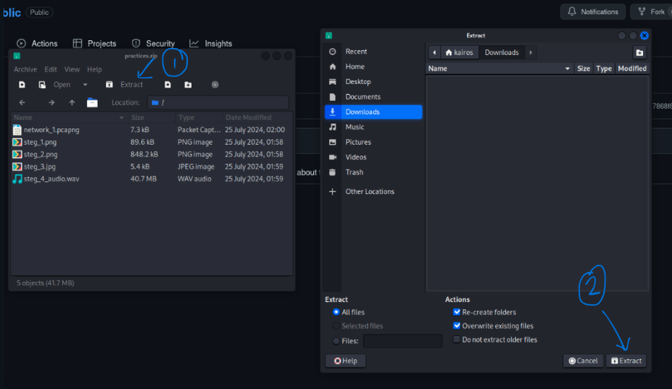

# README !!!

Hi NullSec members! We're excited to meet you all later this evening. To ensure that our session goes smoothly, we'd like you to install some practice file and a software that we'll be using during the session. 

## Instructions

1. Ensure that you have done the preinstallation [[see preinstallation guide](<Forensics Preinstallation Guide.pdf>)] (installation of Kali Linux and setting up your CTFd account).
2. Boot up your Kali Linux machine and open this page you are on, on yoru Kali machine.
3. Download the practice files by clicking [this link](https://github.com/NullSec-SIG/NullSecCTF-Public/raw/main/Intro%20to%20Forensics/practices/practices.zip). 
4. Unzip the downloaded zip file
    
5. Open up your terminal with `Ctrl + Alt + T`.
6. Type in: `sudo apt install audacity`
7. When prompted for your password, type in `kali` if you have not changed it. (Note: You will not see the password being typed in)
8. Type `y` if you are prompted to continue the installation.
9. Done!! See you later :))

## Troubleshooting

Do contact us on Telegram (@kairostay) if you encounter any issues during the installation process. We'll be happy to help you out <3